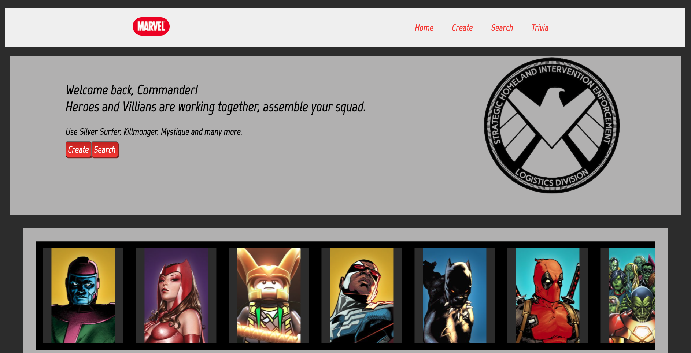
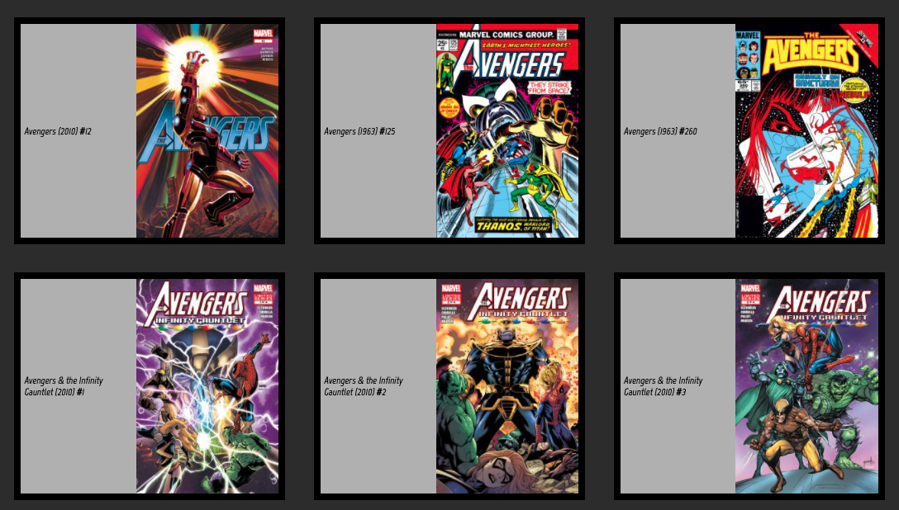
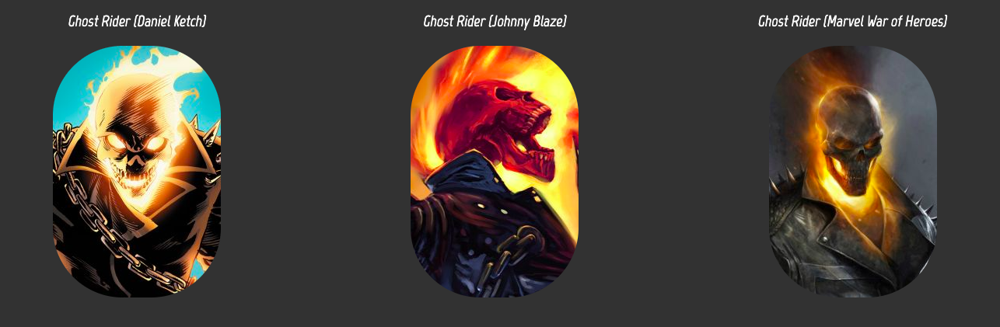

# Test your Marvel Knowledge 


### Description

Commander, there was an idea to bring together a group of remarkable people. This app helps users create and customized teams. Teams & members are models created on the backend. Users can search for heroes or villains by name. Add members to their created team, edit & delete teams or members. Once the team is created user will test their knowledge by asking how many stories, events, or comics that member has. All answers can be found looking at the members' details page 

### Stack

This project was made using\


## Front-End 
* React to create reusable UI components
* Style Components to implement CSS rules 
* Axios to make asynchronous calls to Marvel's API

## [Back-end](https://github.com/hamilton-mike/Marvel-BackEnd)
* Mongoose to manage the relationship between both models (One-to-Many)
* Express providing middleware for RESTful API, database support, enabled CORS 
* Node to communicate on the client-side

## Code Snippet

### Set Images for Home Page
```js
const marvelCall = useCallback(async () => {
        try {
            const ids = [1009452, 1011095, 1009338, 1016181, 1009282, 1009384, 1009562, 1017299, 1017575, 1009187, 1009268, 1009599, 1009648, 1009368, 1009675, 1009577, 1009262, 1009629];
            const carousel = ids.splice(0, 12);
            const cards = ids.slice();

            const promiseOne = carousel.map(async id => axios(`https://gateway.marvel.com/v1/public/characters/${id}?ts=1&apikey=${privateKey}&hash=${hash}`));
            const promiseTwo = cards.map(async id => axios(`https://gateway.marvel.com/v1/public/characters/${id}?ts=1&apikey=${privateKey}&hash=${hash}`));
            const carouselResults = await Promise.all(promiseOne)
            const cardsResults = await Promise.all(promiseTwo)

            setLoading(false)
            setCarousel(carouselResults.map(result => result.data.data.results[0]))
            setCards(cardsResults.map(result => result.data.data.results[0]))
        } catch (error) {
            console.error(error);
        }
    }, [hash, privateKey]);
```
## Live Photos

### Home Page


### Details Page


### Search Page


### Site Map
* [Intro](https://shield-commander.netlify.app/)
* [Home](https://shield-commander.netlify.app/home)
* [Create](https://shield-commander.netlify.app/create)
* [Search](https://shield-commander.netlify.app/search)
* [Trivia](https://shield-commander.netlify.app/trivia)
